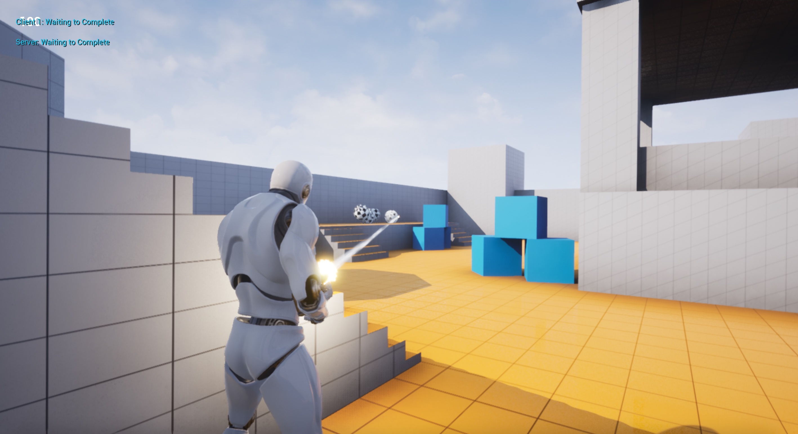

# Coop Game
This is a game created as part of the Udemy course [Unreal Engine 4 Mastery: Create Multiplayer Games with C++](https://www.udemy.com/unrealengine-cpp/) by Tom Looman.

It is a multiplayer cooperative game where you need to work together to kill hordes of autonomous kamakaze tracker bots.

### Conventions: 
* The 'S' prefix stands for shooter.

### References:
* Super useful overview of unreal abstractions http://www.tomlooman.com/ue4-gameplay-framework/

### To build:
* Install UnrealEngine 4.24
* Compile c++ and build unreal engine project

### To debug (macos)
* Open in VSCode
* Install VSCode CodeLLDB extension (1.5.3 used)
* Debug using one of the editor condigurations, e.g. `CoopGameEditor (Debug)`
This will boot the game in the editor with the visual debugger attached.  

### Tools used:
* VSCode on macos

### Super helpful unreal editor shortcuts
* ~ open console

### Won't compile on Big Sur?
Try patching this: https://github.com/EpicGames/UnrealEngine/commit/1d252ee345cdf6c232b20c3b4bf14f13bb569c9d